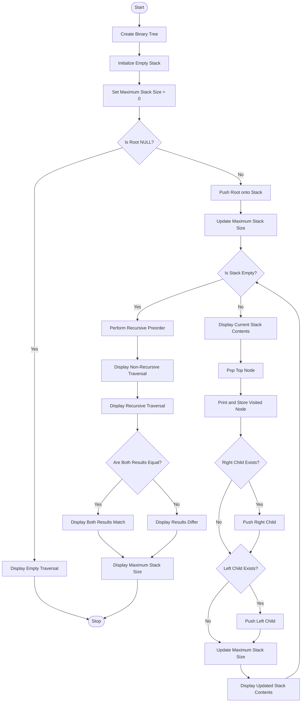

```mermaid
flowchart TD
    A([Start]) --> B[Create Binary Tree]
    B --> C[Initialize Empty Stack]
    C --> D[Set Maximum Stack Size = 0]
    D --> E{Is Root NULL?}

    E -- Yes --> F[Display Empty Traversal]
    F --> Z([Stop])

    E -- No --> G[Push Root onto Stack]
    G --> H[Update Maximum Stack Size]
    H --> I{Is Stack Empty?}

    I -- Yes --> J[Perform Recursive Preorder]
    J --> K[Display Non-Recursive Traversal]
    K --> L[Display Recursive Traversal]
    L --> M{Are Both Results Equal?}

    M -- Yes --> N[Display Both Results Match]
    M -- No --> O[Display Results Differ]

    N --> P[Display Maximum Stack Size]
    O --> P
    P --> Z

    I -- No --> Q[Display Current Stack Contents]
    Q --> R[Pop Top Node]
    R --> S[Print and Store Visited Node]
    S --> T{Right Child Exists?}

    T -- Yes --> U[Push Right Child]
    T -- No --> V{Left Child Exists?}
    U --> V

    V -- Yes --> W[Push Left Child]
    V -- No --> X[Update Maximum Stack Size]
    W --> X

    X --> Y[Display Updated Stack Contents]
    Y --> I
```
