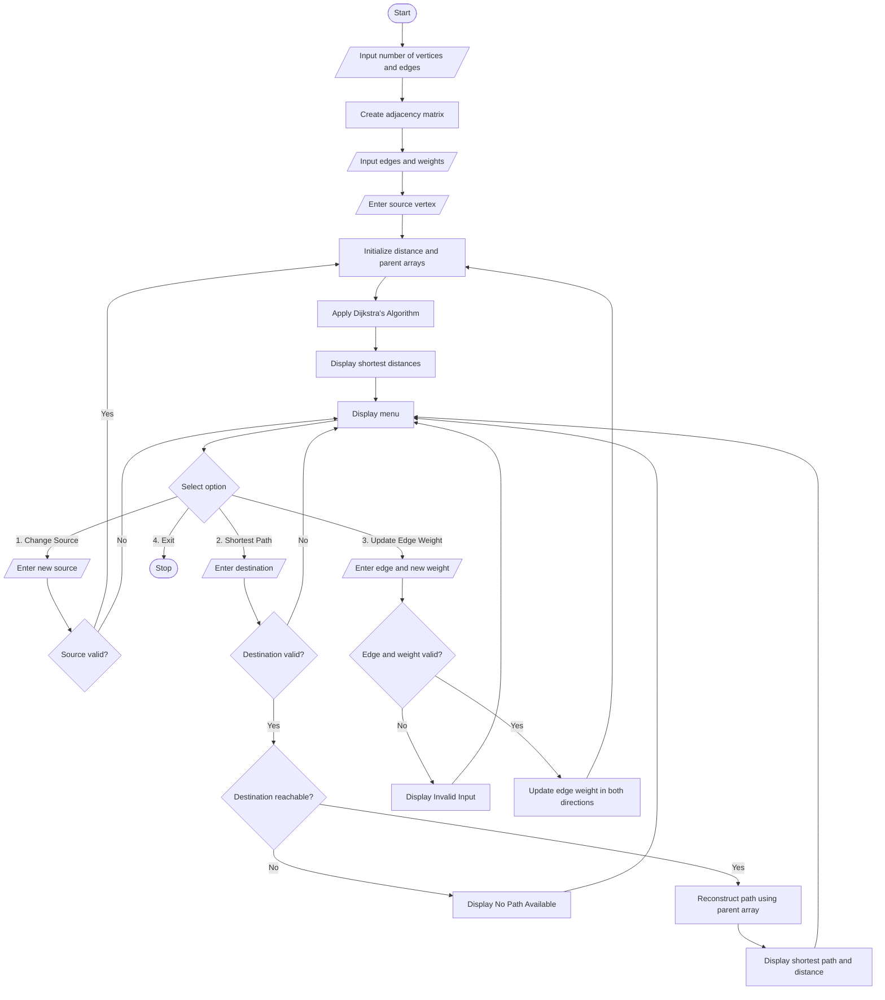

## Modified Flowchart

```mermaid
flowchart TD
    A([Start]) --> B[/Input number of vertices and edges/]
    B --> C[Create adjacency matrix]
    C --> D[/Input edges and weights/]
    D --> E[/Enter source vertex/]
    E --> F[Initialize distance and parent arrays]
    F --> G[Apply Dijkstra's Algorithm]
    G --> H[Display shortest distances]
    H --> I[Display menu]
    I --> J{Select option}

    J -->|1. Change Source| K[/Enter new source/]
    K --> L{Source valid?}
    L -->|Yes| F
    L -->|No| I

    J -->|2. Shortest Path| M[/Enter destination/]
    M --> N{Destination valid?}
    N -->|No| I
    N -->|Yes| O{Destination reachable?}
    O -->|No| P[Display No Path Available]
    O -->|Yes| Q[Reconstruct path using parent array]
    Q --> R[Display shortest path and distance]
    P --> I
    R --> I

    J -->|3. Update Edge Weight| S[/Enter edge and new weight/]
    S --> T{Edge and weight valid?}
    T -->|No| U[Display Invalid Input]
    U --> I
    T -->|Yes| V[Update edge weight in both directions]
    V --> F

    J -->|4. Exit| W([Stop])
```
