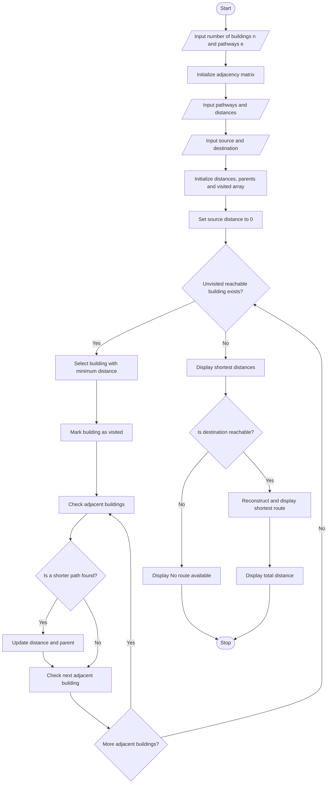

## Flowchart

```mermaid
flowchart TD
    A([Start]) --> B[/Input number of buildings n and pathways e/]
    B --> C[Initialize adjacency matrix]
    C --> D[/Input pathways and distances/]
    D --> E[/Input source and destination/]
    E --> F[Initialize distances, parents and visited array]
    F --> G[Set source distance to 0]
    G --> H{Unvisited reachable building exists?}
    H -- Yes --> I[Select building with minimum distance]
    I --> J[Mark building as visited]
    J --> K[Check adjacent buildings]
    K --> L{Is a shorter path found?}
    L -- Yes --> M[Update distance and parent]
    L -- No --> N[Check next adjacent building]
    M --> N
    N --> O{More adjacent buildings?}
    O -- Yes --> K
    O -- No --> H
    H -- No --> P[Display shortest distances]
    P --> Q{Is destination reachable?}
    Q -- No --> R[Display No route available]
    Q -- Yes --> S[Reconstruct and display shortest route]
    S --> T[Display total distance]
    R --> U([Stop])
    T --> U
```
